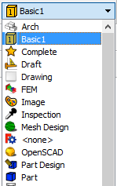

# How to create your own Python workbench

## Description
You can create your own FreeCAD [workbench](https://www.freecadweb.org/wiki/Workbenches).

In this tutorial you will learn how to create a very simple workbench using [python script commands](https://www.freecadweb.org/wiki/Introduction_to_Python) and making the interface with [PySide](https://www.freecadweb.org/wiki/PySide).

## Introduction
Power users have extended FreeCAD with various custom external workbenches that are not integrated in FreeCAD.
You can check these external workbenches here: https://www.freecadweb.org/wiki/External_workbenches

Information about installing workbenches can be found in the [FreeCAD documentation](https://www.freecadweb.org/wiki/Installing_more_workbenches)
 and in this [tutorial](https://www.freecadweb.org/wiki/How_to_install_additional_workbenches)

You can create workbenches following this [FreeCAD documentation](https://www.freecadweb.org/wiki/Workbench_creation).

Workbenches are containers for FreeCAD commands. These commands can be coded in Python or C++ 

This tutorial will lead you through the steps of the creation of a very simple workbench with Python commands.

## Single command Workbench

Let us create a very simple workbench with just one command to create a box.
Obviously, there is no need to create this workbench, since you have the [Part Box](https://www.freecadweb.org/wiki/Part_Box) command availabe in the [Part workbench](https://www.freecadweb.org/wiki/Part_Module)

As explained in the [Workbech creation documentation](https://www.freecadweb.org/wiki/Workbench_creation) we have to create a folder, with any name we like, in the Mod directory.

In this folder we are going to have 3 files:
+ Init.py
+ InitGui.py
+ Basic1Gui.py

### Init.py

The file [Init.py](basic1_wb/Init.py) has no contents, you can just include your name (John Doe), the module name (we have called it BASIC1_WB) and the license:

```python
# FreeCAD init script of BASIC1_WB module  

#***************************************************************************
#*   (c) John Doe john@doe.com 2017                                        *   
#*                                                                         *
#*   This file is part of the FreeCAD CAx development system.              *
#*                                                                         *
#*   This program is free software; you can redistribute it and/or modify  *
#*   it under the terms of the GNU Lesser General Public License (LGPL)    *
#*   as published by the Free Software Foundation; either version 2 of     *
#*   the License, or (at your option) any later version.                   *
#*   for detail see the LICENCE text file.                                 *
#*                                                                         *
#*   FreeCAD is distributed in the hope that it will be useful,            *
#*   but WITHOUT ANY WARRANTY; without even the implied warranty of        *
#*   MERCHANTABILITY or FITNESS FOR A PARTICULAR PURPOSE.  See the         *
#*   GNU Lesser General Public License for more details.                   *
#*                                                                         *
#*   You should have received a copy of the GNU Library General Public     *
#*   License along with FreeCAD; if not, write to the Free Software        *
#*   Foundation, Inc., 59 Temple Place, Suite 330, Boston, MA  02111-1307  *
#*   USA                                                                   *
#*                                                                         *
#***************************************************************************/
```

### InitGui.py

In the same folder, we are going to create another file called [InitGui.py](basic1_wb/InitGui.py).
This file defines the workbench, which contains a name, an icon, and a series of FreeCAD commands.

 
```python

class Basic1Workbench (Workbench):
    """Basic 1 workbench object"""
    # this is the icon in XPM format 16x16 pixels
    Icon = """
    /* XPM */
    static char * basic1_xpm[] = {
    "16 16 5 1",
    " 	c None",
    ".	c #FFFFFF",
    "+	c #000000",
    "@	c #7F4F00",
    "#	c #FFBF00",
    "................",
    "...++++++++++++.",
    "..+@#########++.",
    ".+@#########+@+.",
    ".+++++++++++@#+.",
    ".+#########+##+.",
    ".+###++####+##+.",
    ".+####+####+##+.",
    ".+####+####+##+.",
    ".+####+####+##+.",
    ".+####+####+##+.",
    ".+####+####+##+.",
    ".+###+++###+#@+.",
    ".+#########+@+..",
    ".++++++++++++...",
    "................"};
    """

    MenuText = "Basic1"
    ToolTip = "Basic 1 workbench"

    def Initialize(self) :
        "This function is executed when FreeCAD starts"
        from PySide import QtCore, QtGui
        # python file where the commands are:
        import Basic1Gui
        # list of commands, only one (it is in the imported Basic1Gui):
        cmdlist = [ "Basic1_MakeBox"]
        self.appendToolbar(
            str(QtCore.QT_TRANSLATE_NOOP("Basic1", "Basic1")), cmdlist)
        self.appendMenu(
            str(QtCore.QT_TRANSLATE_NOOP("Basic1", "Basic1")), cmdlist)

        Log ('Loading Basic1 module... done\n')

    def GetClassName(self):
        return "Gui::PythonWorkbench"

# The workbench is added:
Gui.addWorkbench(Basic1Workbench())
```

So the class Basic1Workbench creates the basic workbench when called.
 
```python
class Basic1Workbench (Workbench):
```

This example is very basic, check https://www.freecadweb.org/wiki/Workbench_creation for more information.

Inside the class, an icon is created. This is the [workbench](https://www.freecadweb.org/wiki/Workbenches) icon that you will see on the workbench selection 



The icon is in XPM format (https://en.wikipedia.org/wiki/X_PixMap).
It has 16x16 pixels and you can created it with [gimp](https://www.gimp.org/).
Then open saved file with a text editor and paste in the InitGui.py file.
These are the files>
+ [b1_wb.xcf](imgs/b1_wb.xcf)
+ [b1_wb.xpm](imgs/b1_wb.xpm)

```python
    # this is the icon in XPM format 16x16 pixels 
    Icon = """
    /* XPM */
    static char * basic1_xpm[] = {
    "16 16 5 1",
    " 	c None",
    ".	c #FFFFFF",
    "+	c #000000",
    "@	c #7F4F00",
    "#	c #FFBF00",
    "................",
    "...++++++++++++.",
    "..+@#########++.",
    ".+@#########+@+.",
    ".+++++++++++@#+.",
    ".+#########+##+.",
    ".+###++####+##+.",
    ".+####+####+##+.",
    ".+####+####+##+.",
    ".+####+####+##+.",
    ".+####+####+##+.",
    ".+####+####+##+.",
    ".+###+++###+#@+.",
    ".+#########+@+..",
    ".++++++++++++...",
    "................"};
    """
```

Then the name of the workbench and a description:

```python
    MenuText = "Basic1"
    ToolTip = "Basic 1 workbench"
```

The method Initialize creates the Toolbar and the Menu for the new workbench
Basic1Gui.py is imported because the command Basic1_MakeBox is defined there

```python
    def Initialize(self) :
        "This function is executed when FreeCAD starts"
        from PySide import QtCore, QtGui
        # python file where the commands are:
        import Basic1Gui
        # list of commands, only one (it is in the imported Basic1Gui):
        cmdlist = [ "Basic1_MakeBox"]
        self.appendToolbar(
            str(QtCore.QT_TRANSLATE_NOOP("Basic1", "Basic1")), cmdlist)
        self.appendMenu(
            str(QtCore.QT_TRANSLATE_NOOP("Basic1", "Basic1")), cmdlist)

        #FreeCADGui.addIconPath(":/icons")
        Log ('Loading Basic1 module... done\n')
```

The last line adds the workbench:

```python
Gui.addWorkbench(Basic1Workbench())
```

### Basic1Gui.py

[Basic1Gui.py](basic1_wb/Basic1Gui.py) defines the command Basic1_MakeBox:


```python
import PySide
from PySide import QtCore, QtGui
import FreeCAD
import FreeCADGui
import os

__dir__ = os.path.dirname(__file__)

# FreeCAD Command made with a Python script
def MakeBox():
    doc = FreeCAD.ActiveDocument
    box =  doc.addObject("Part::Box",'box')
    box.Length = 1
    box.Width  = 1
    box.Height = 1

# GUI command that links the Python script
class _MakeBoxCmd:
    """Command to create a box"""
    
    def Activated(self):
        # what is done when the command is clicked
        MakeBox()

    def GetResources(self):
        # icon and command information
        MenuText = QtCore.QT_TRANSLATE_NOOP(
            'Basic1_Box',
            'Box')
        ToolTip = QtCore.QT_TRANSLATE_NOOP(
            'Basic1_Box',
            'Creates a new box')
        return {
            'Pixmap': __dir__ + '/icons/basic1_makebox_cmd.svg',
            'MenuText': MenuText,
            'ToolTip': ToolTip}

    def IsActive(self):
        # The command will be active if there is an active document
        return not FreeCAD.ActiveDocument is None

FreeCADGui.addCommand('Basic1_MakeBox', _MakeBoxCmd())
```


So, what we have first is the function that makes a box, this is just a very simple python script that you can see here: https://www.freecadweb.org/wiki/Part_Box#Scripting

We have named the box and also defined its dimensions:

```python
# FreeCAD Command made with a Python script
def MakeBox():
    doc = FreeCAD.ActiveDocument
    box =  doc.addObject("Part::Box",'box')
    box.Length = 1
    box.Width  = 1
    box.Height = 1
```

Then we have the class for the command and links to the MakeBox funtion:

```python
# GUI command that links the Python script
class _MakeBoxCmd:
    """Command to create a box"""
    
    def Activated(self):
        # what is done when the command is clicked
        MakeBox()

    def GetResources(self):
        # icon and command information
        MenuText = QtCore.QT_TRANSLATE_NOOP(
            'Basic1_Box',
            'Box')
        ToolTip = QtCore.QT_TRANSLATE_NOOP(
            'Basic1_Box',
            'Creates a new box')
        return {
            'Pixmap': __dir__ + '/icons/basic1_makebox_cmd.svg',
            'MenuText': MenuText,
            'ToolTip': ToolTip}

    def IsActive(self):
        # The command will be active if there is an active document
        return not FreeCAD.ActiveDocument is None
```

There are 3 methods, when we click on the command **Activated** is call, and we just call the MakeBox function.

Then the **GetResources** method indicates the name, information and the icon for the command.
The icon is a 64x64 svg file [basic1_makebox_cmd.svg](basic1_wb/icons/basic1_makebox_cmd.svg) . You can create it with [inkscape](https://inkscape.org)

Check the color code for icons here: https://www.freecadweb.org/wiki/Gui_Command#Icons

The **IsActive** method indicates when the command is active. In our case, it will be active when there is an active document, so we can place the box in it. If not, it will be disabled.


In the last line, the command is added, and the link is made with the name on InitGui and the class in Basic1Gui.py

```python
FreeCADGui.addCommand('Basic1_MakeBox', _MakeBoxCmd())
```

## File structure

Now we have to copy these files in the FreeCAD Mod folder and we will have our own workbench:

```
Mod/
  +-- Basic1/
      +-- Init.py
      +-- InitGui.py
      +-- Basic1Gui.py
      +-- icons/
          +-- basic1_makebox_cmd.svg
```


