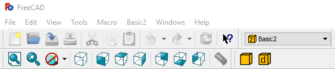
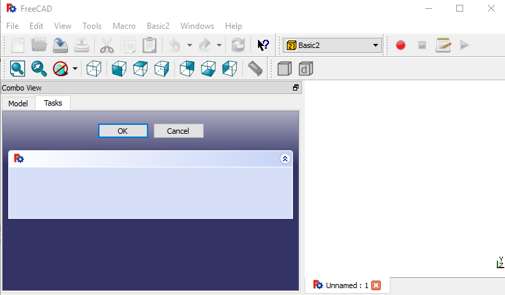

# How to create a very simple dialog for a command in FreeCAD

## Description
In the previous [tutorial](./tut_fwb_1.md) we learned how to create your FreeCAD Workbench and how to add a command to create a box.

Now we are going to add a very simple dialog that will do the same.
This approach does not offer any improvement from the previous, but will allow us to learn how to make dialogs for the next tutorials

The information of this tutorial has been obtained from the FreeCAD website and in particular this [page](https://www.freecadweb.org/wiki/Manual:Creating_interface_tools)

Check the [index](./readme.md) for more tutorials

## Introduction
We are going to have the files in a different folder named Basic2

```
Mod/
  +-- Basic2/
      +-- Init.py
      +-- InitGui.py
      +-- Basic2Gui.py
      +-- icons/
          +-- basic2_makebox_cmd.svg
          +-- basic2_makeboxdialog_cmd.svg
```

## Simple dialog command

We are going to add a command with a very simple dialog to our previous workbench 

### Init.py

The file [Init.py](basic2_wb/Init.py) will be the same as in Basic1 Workbench

### InitGui.py

We are going to make modifications to the [InitGui.py](basic2_wb/InitGui.py).

The icon, MenuText and ToolTip are different. Check the file to see what is different.

For this workbench, the Initialize function will have 2 commands:
- Basic2_MakeBox
- Basic2_MakeBoxDialog

Basic2_MakeBox is the same as in Basic1 (only the name has been changed)

Basic2_MakeBoxDialog is the new command that we are introducing. As we will see, this command will have a dialog in the Task Panel.

We are only going to review the main difference in the Initialize method.
This difference is that now **cmdlist** has 2 elements, which are the 2 commands that our workbench will have.

```python

    def Initialize(self) :
        "This function is executed when FreeCAD starts"
        from PySide import QtCore, QtGui
        # python file where the commands are:
        import Basic2Gui
        # list of commands, just 2 (they are in Basic2Gui):
        cmdlist = [ "Basic2_MakeBox", "Basic2_MakeBoxDialog"]
        self.appendToolbar(
            str(QtCore.QT_TRANSLATE_NOOP("Basic2", "Basic2")), cmdlist)
        self.appendMenu(
            str(QtCore.QT_TRANSLATE_NOOP("Basic2", "Basic2")), cmdlist)

        Log ('Loading Basic2 module... done\n')

```

The rest of the code is basically the same as in Basic1/InitGui.py as explained in the previous [tutorial](./tut_fwb_1.md)

### Basic2Gui.py

[Basic2Gui.py](basic2_wb/Basic2Gui.py) defines the 2 commands of our workbench:
1. Basic2_MakeBox:
1. Basic2_MakeBoxDialog:

Basic2_MakeBox is the same as in Basic1, so we will skip that. We included it to have a workbench with 2 commands.




We are going to review the code for Basic2_MakeBoxDialog


```python

# Task Panel creation, the task panel has to have:
#   1. a widget called self.form
#   2. reject and accept methods (if needed)
class BoxSimpleTaskPanel:
    def __init__(self,widget):
        self.form = widget

    # Ok and Cancel buttons are created by default in FreeCAD Task Panels
    # What is done when we click on the ok button.
    def accept(self):
        MakeBox()
        FreeCADGui.Control.closeDialog() #close the dialog

    # What is done when we click on the cancel button.
    # commented because this is the default behaviour
    #def reject(self):
    #   FreeCADGui.Control.closeDialog()

# GUI command that links the Python script
class _MakeBoxDialogCmd:
    """Command to create a box with a Ok Cancel buttons
    """

    def Activated(self):
        # what is done when the command is clicked
        # creates a panel with a dialog
        baseWidget = QtGui.QWidget()
        panel = BoxSimpleTaskPanel(baseWidget)
        # having a panel with a widget in self.form and the accept and 
        # reject functions (if needed), we can open it:
        FreeCADGui.Control.showDialog(panel)

    def GetResources(self):
        # icon and command information
        MenuText = QtCore.QT_TRANSLATE_NOOP(
            'Basic2_DBox',
            'Box Dialog')
        ToolTip = QtCore.QT_TRANSLATE_NOOP(
            'Basic2_DBox',
            'Creates a box using a task panel dialog')
        return {
            'Pixmap': __dir__ + '/icons/basic2_makeboxdialog_cmd.svg',
            'MenuText': MenuText,
            'ToolTip': ToolTip}

    def IsActive(self):
        # The command will be active if there is an active document
        return not FreeCAD.ActiveDocument is None

FreeCADGui.addCommand('Basic2_MakeBoxDialog', _MakeBoxDialogCmd())

```

As we have seen in the previous tutorial the class **_MakeBoxDialogCmd** links the command with the Python script.

When we click on the command the method **Activated** is called.

```python
    def Activated(self):
        # what is done when the command is clicked
        # creates a panel with a dialog
        baseWidget = QtGui.QWidget()
        panel = BoxSimpleTaskPanel(baseWidget)
        # having a panel with a widget in self.form and the accept and 
        # reject functions (if needed), we can open it:
        FreeCADGui.Control.showDialog(panel)
```

In this method, a widget is created (baseWidget)

This widget is passed as an argument for the function BoxSimpleTaskPanel, and we get the object **panel**

We can open the task panel with the **panel** dialog:
```python
        FreeCADGui.Control.showDialog(panel)
```

FreeCADGui.Control is the Control Task Dialog


#### BoxSimpleTaskPanel

This class creates a very simple Task Panel:

```python

class BoxSimpleTaskPanel:
    def __init__(self,widget):
        self.form = widget

    def accept(self):
        MakeBox()
        FreeCADGui.Control.closeDialog() #close the dialog
```

It just assigns the widget passed as argument to the attribute *form*

And defines what it is going to do when the Ok button is clicked.
It will make the box (see [tutorial](./tut_fwb_1.md) and close the Dialog.

You can also include what happens when the **Cancel** button is pressed.
In this case, since we have not include it, it will just do nothing and close the dialog. It would have been the same as adding the **reject** method to BoxSimpleTaskPanel:

```python

    def reject(self):
       FreeCADGui.Control.closeDialog()
```

So if we click on the Simple Dialog Command we will get the following Task Panel Dialog:



If we click in **Ok**, we will get a new cube.

So it is nothing new, but in the next tutorial we will learn how to add parameters to the dialog
