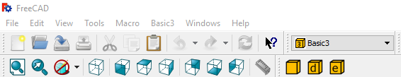
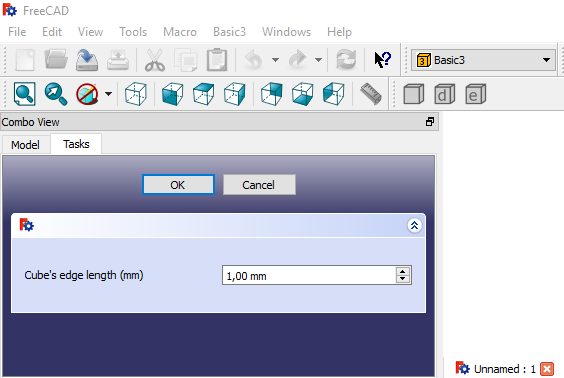

# How to create a simple dialog to set a parameter

## Description
In the second [tutorial](./tut_fwb_2.md) we learned how to create a dialog for a FreeCAD command Workbench. 

Now we are going to an input box in the dialog to be able to set the length 

Check the [index](./readme.md) for more tutorials

## Introduction
We are going to have the files in a different folder named Basic3

```
Mod/
  +-- Basic3/
      +-- Init.py
      +-- InitGui.py
      +-- Basic3Gui.py
      +-- icons/
          +-- basic3_makebox_cmd.svg
          +-- basic3_makeboxdialog_cmd.svg
          +-- basic3_makeboxedge_cmd.svg
```

## Dialog with an input box

We are going to add a label and an input box to the dialog to set the cube edge length

### Init.py

The file [Init.py](basic3_wb/Init.py) will be the same as in the previous Workbenches

### InitGui.py

We are going to make modifications to the [InitGui.py](basic3_wb/InitGui.py).

The icon, MenuText and ToolTip are different. Check the file to see what is different.

For this workbench, the Initialize function will have 3 commands:
- Basic3_MakeBox
- Basic3_MakeBoxDialog
- Basic3_MakeBoxEdgeP

Basic3_MakeBox and Basic3_MakeBoxDialog are the same as in Basic2 (only the name has been changed)

Basic3_MakeBoxEdgeP is the new command that we are introducing.

We are only going to review the main difference in the Initialize method.
This difference is that now **cmdlist** has 3 elements, which are the 3 commands that our workbench will have.

```python

    def Initialize(self) :
        "This function is executed when FreeCAD starts"
        from PySide import QtCore, QtGui
        # python file where the commands are:
        import Basic3Gui
        # list of commands, just 3 (they are in the imported Basic3Gui):
        cmdlist = [ "Basic3_MakeBox",
                    "Basic3_MakeBoxDialog",
                    "Basic3_MakeBoxEdgeP"]
        self.appendToolbar(
            str(QtCore.QT_TRANSLATE_NOOP("Basic3", "Basic3")), cmdlist)
        self.appendMenu(
            str(QtCore.QT_TRANSLATE_NOOP("Basic3", "Basic3")), cmdlist)


```

The rest of the code is basically the same as in Basic1/InitGui.py as explained in the first [tutorial](./tut_fwb_1.md)

### Basic3Gui.py

[Basic2Gui.py](basic2_wb/Basic2Gui.py) defines the 2 commands of our workbench:
1. Basic3_MakeBox:
1. Basic3_MakeBoxDialog:
1. Basic3_MakeBoxEdgeP:

Basic3_MakeBox and Basic3_MakeBoxDialgo are the same as in Basic2, so we will skip that. We included it to have a workbench with 3 commands.




We are going to review the code for Basic3_MakeBoxEdgeP


```python

class BoxEdgePTaskPanel:
    def __init__(self,widget):
        self.form = widget
        layout = QtGui.QHBoxLayout()
        self.edgeLabel = QtGui.QLabel("Cube's edge length (mm)")
        # The layout will be horizontal
        # Spin Box that takes doubles
        self.edgeValue = QtGui.QDoubleSpinBox()
        # Default value
        self.edgeValue.setValue(1)
        # suffix to indicate the units
        self.edgeValue.setSuffix(' mm')
        layout.addWidget(self.edgeLabel)
        layout.addWidget(self.edgeValue)
        self.form.setLayout(layout)

    # Ok and Cancel buttons are created by default in FreeCAD Task Panels
    # What is done when we click on the ok button.
    def accept(self):
        edge_length = self.edgeValue.value()
        MakeBox(edge_length, 'box_edge')
        FreeCADGui.Control.closeDialog() #close the dialog

    # What is done when we click on the cancel button.
    # commented because this is the default behaviour
    #def reject(self):
    #   FreeCADGui.Control.closeDialog()

# GUI command that links the Python script
class _MakeBoxEdgeP:
    """Command to create a box with a dialog where you can set the Edge length
    """

    def Activated(self):
        # what is done when the command is clicked
        # creates a panel with a dialog
        baseWidget = QtGui.QWidget()
        panel = BoxEdgePTaskPanel(baseWidget)
        # having a panel with a widget in self.form and the accept and 
        # reject functions (if needed), we can open it:
        FreeCADGui.Control.showDialog(panel)

    def GetResources(self):
        # icon and command information
        MenuText = QtCore.QT_TRANSLATE_NOOP(
            'Basic3_PBox',
            'Edge Parameter Box Dialog')
        ToolTip = QtCore.QT_TRANSLATE_NOOP(
            'Basic3_PBox',
            'Creates a box using a dialog to choose the edge length')
        return {
            'Pixmap': __dir__ + '/icons/basic3_makeboxedge_cmd.svg',
            'MenuText': MenuText,
            'ToolTip': ToolTip}

    def IsActive(self):
        # The command will be active if there is an active document
        return not FreeCAD.ActiveDocument is None


FreeCADGui.addCommand('Basic3_MakeBoxEdgeP', _MakeBoxEdgeP())

```

The class **_MakeBoxEdgeP** is very similar to the previous [tutorial](./tut_fwb_2.md)

The main difference is in **BoxEdgePTaskPanel**

Now, we add the Label and the Spin Box. To add them, first we include a **QHBoxLayout** to line the label and the Spin Box horizontally:

```python
        layout = QtGui.QHBoxLayout()
```

Then we add the label:

```python
        self.edgeLabel = QtGui.QLabel("Cube's edge length (mm)")
```

Next, the spin box, where we also set the default value, and a suffix for the units

```python
        self.edgeValue = QtGui.QDoubleSpinBox()
        # Default value
        self.edgeValue.setValue(1)
        # suffix to indicate the units
        self.edgeValue.setSuffix(' mm')
```

Last we add the label and the spinbox to the layout, and set the layout of the widget:

```python
        layout.addWidget(self.edgeLabel)
        layout.addWidget(self.edgeValue)
        self.form.setLayout(layout)
```

---

If the **Ok** button is clicked, we have to get the value introduced in the spin box, we do that in the **accept** method:

```python
    def accept(self):
        edge_length = self.edgeValue.value()
        MakeBox(edge_length, 'box_edge')
        FreeCADGui.Control.closeDialog() #close the dialog
```

---

Last, the function **MakeBox** has been modified to accept arguments:


```python
def MakeBox(edge_len = 1, boxname='box'):
    doc = FreeCAD.ActiveDocument
    box =  doc.addObject("Part::Box",boxname)
    box.Length = edge_len
    box.Width  = edge_len
    box.Height = edge_len
```

So if we click on the MakeBoxEdgeP Command we will get the following Task Panel Dialog:



We can set the edge length, and the click in **Ok** to get a new cube.

