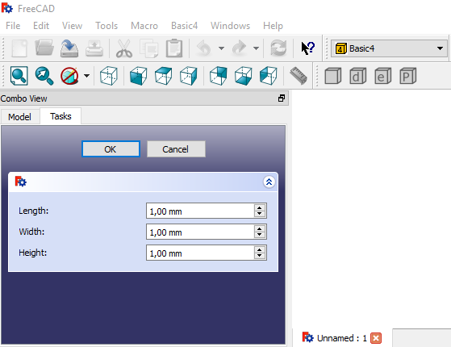

# How to create a dialog to set 3 parameters

## Description
In this example we will have 3 parameters to set: Length, Width and Height

There is not much else to explain if you have seen the previous tutorials. See the source code of [Basic4Gui.py](basic4_wb/Basic4Gui.py). It includes comments to understand the grid used to arrange the labels and input boxes.

If you don't understand anything, check the [index](./readme.md) to see the previous tutorials

By clicking on the parametric command, we will get the following dialog:

*Note: In the image, the decimal point is a comma because of the regional/language computer configuration*

We can set the length of each edge, by clicking on **Ok** we will get a new cube with the chosen dimension.

These are the files of this tutorial:

---------

Mod/

+-- basic4_wb/

+---- [Init.py](basic4_wb/Init.py)

+---- [InitGui.py](basic4_wb/InitGui.py)

+---- [Basic4Gui.py](basic4_wb/Basic4Gui.py)

+---- icons/

+------- [basic4_makebox_cmd.svg](basic4_wb/icons/basic4_makebox_cmd.svg) 

+------- [basic4_makeboxdialog_cmd.svg](basic4_wb/icons/basic4_makeboxdialog_cmd.svg) 

+------- [basic4_makeboxedge_cmd.svg](basic4_wb/icons/basic4_makeboxedge_cmd.svg) 

+------- [basic4_makeboxparam_cmd.svg](basic4_wb/icons/basic4_makeboxparam_cmd.svg) 

---------

